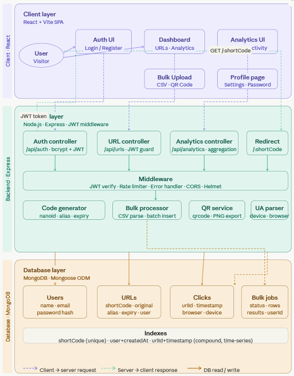
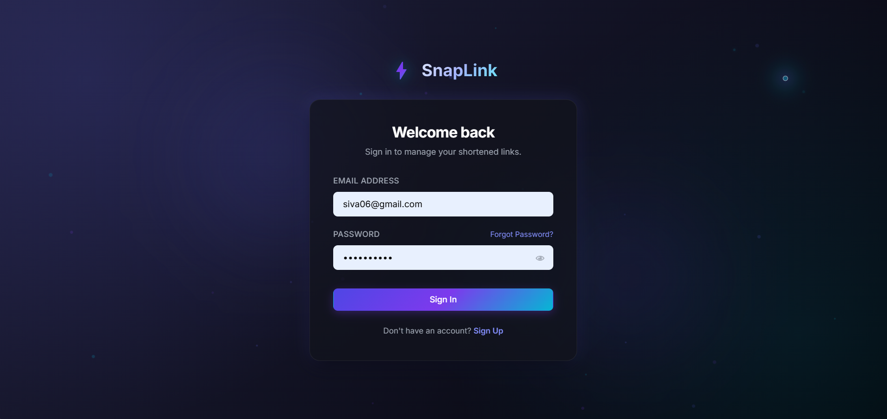
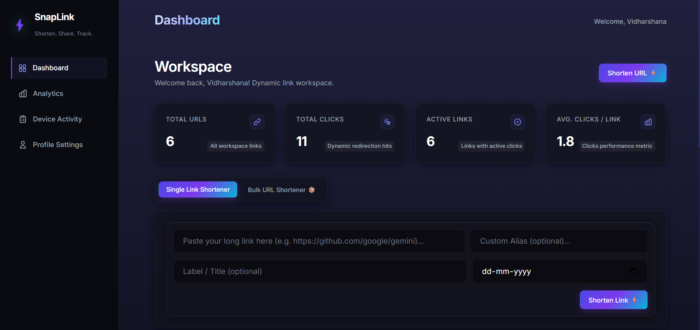
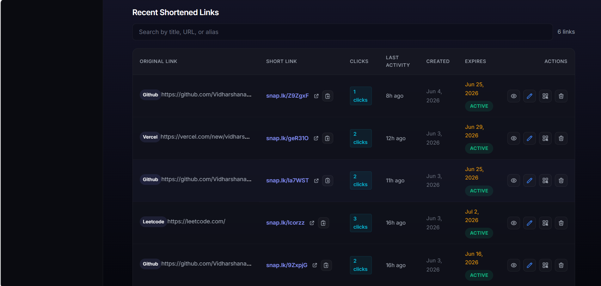
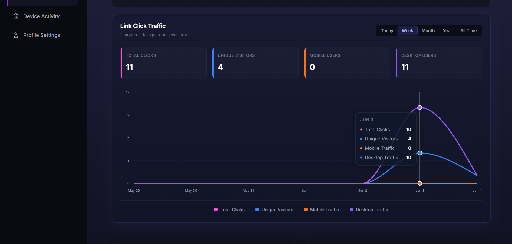
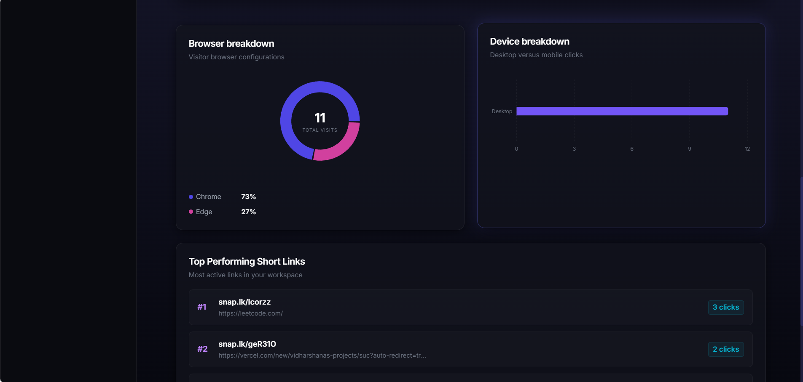
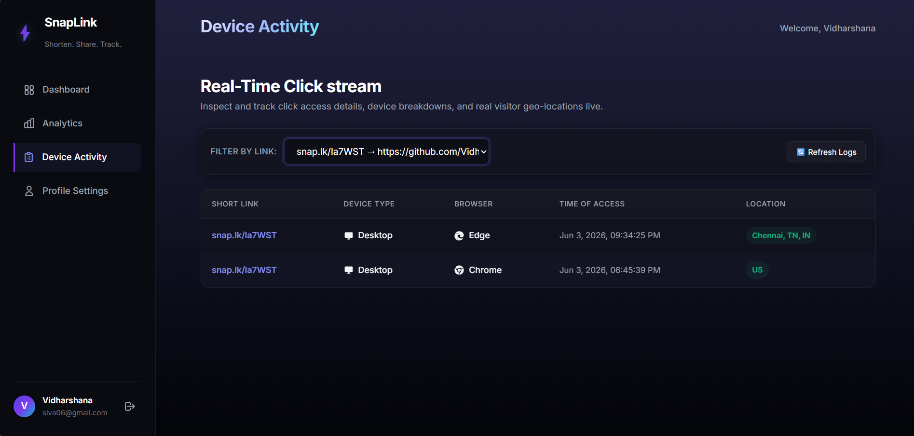
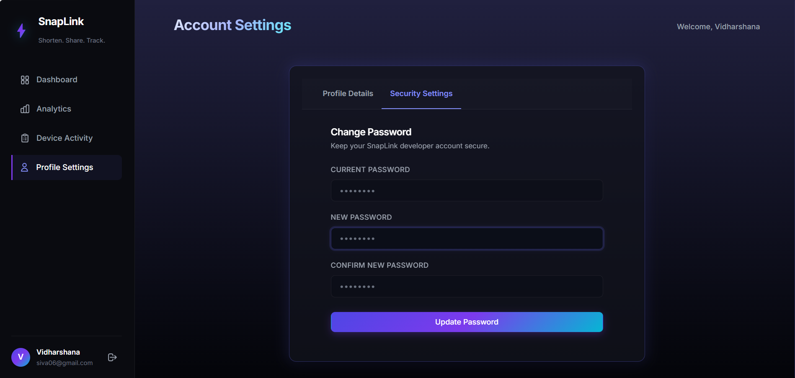
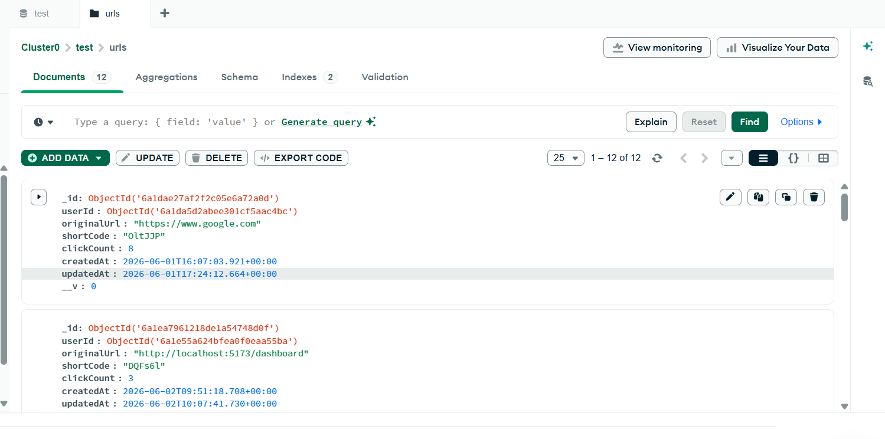

# SnapLink - URL Shortener & Analytics Platform

SnapLink is a high-performance, full-stack link management and analytics platform. Featuring a modern, premium dark SaaS design system, SnapLink offers secure user authentication, custom link creation, bulk url shortening, and real-time geolocation analytics.

Live Deployment: https://snap-link-gilt.vercel.app/
Explanatory Video Link: https://youtu.be/bwpLbnafsgM
---

## Key Features

* Secure Authentication & Session Management:
Sign-up and login with encrypted passwords using BcryptJS. JWT-based stateless authentication via Axios interceptors. Includes animated and interactive auth UI.
Dynamic URL Shortening & Customization:
Generate unique short links using nanoid. Supports custom aliases, titles, and expiration dates with database-level uniqueness validation.
Bulk URL Shortener:
Shorten multiple URLs via text input or .csv/.txt upload. Returns structured output with one-click copy and share support.
Real-time Analytics Dashboard:
Tracks clicks, active links, and performance metrics in real time. Includes geolocation (country, city), device/browser detection, and visual charts using Recharts.
QR Code & Native Sharing:
Generates downloadable QR codes for each link. Supports native sharing (navigator.share) and clipboard fallback options.
Smart Expiry Handling:
Automatically validates expired links and redirects users to a custom /expired page instead of showing errors.
---

## Tech Stack

### Frontend
*   **Core**: React 19 (Vite), JavaScript (ES Modules)
*   **Styling**: Vanilla CSS featuring a premium dark SaaS theme, translucent cards, glows, and sub-pixel borders.
*   **Routing**: React Router DOM (v7)
*   **Analytics Visualization**: Recharts
*   **Icons**: React Icons & Lucide React
*   **Integration**: Axios (with custom auth headers request interceptor)

### Backend
*   **Core**: Node.js, Express (v5)
*   **Database**: MongoDB (configured via Mongoose v9)
*   **Security**: JWT, BcryptJS, CORS
*   **Utilities**: geoip-lite, nanoid, dotenv

---

## Setup Instructions

### Prerequisites
*   Node.js (v18 or higher)
*   MongoDB (Running locally on default port `27017` or a MongoDB Atlas cloud cluster URI)

### Backend Setup
1. Navigate to the `server` directory:
   ```bash
   cd server
   ```
2. Install dependencies:
   ```bash
   npm install
   ```
3. Create a `.env` file in the root of the `server` folder and specify the configuration:
   ```env
   PORT=5000
   MONGO_URI=mongodb://localhost:27017/snaplink
   JWT_SECRET=your_super_secret_jwt_key
   BASE_URL=http://localhost:5000
   FRONTEND_URL=http://localhost:5173
   ```
4. Start the development server:
   ```bash
   npm run dev
   ```

### Frontend Setup
1. Navigate to the `client` directory:
   ```bash
   cd client
   ```
2. Install dependencies:
   ```bash
   npm install
   ```
3. (Optional) Point the client API baseURL to your local server. In `client/src/services/api.js`:
   ```javascript
   const API = axios.create({
     baseURL: "http://localhost:5000/api", // local dev server
   });
   ```
4. Start the development server:
   ```bash
   npm run dev
   ```
5. Open your browser and go to `http://localhost:5173`.

---

## Sample API Responses

To help you understand the data schemas in action, here are sample JSON payloads returned by SnapLink's API endpoints:

### 1. Create Short Link (`POST /api/url/create`)
*   **Headers**: `Authorization: Bearer <JWT_TOKEN>`
*   **Request Body**:
    ```json
    {
      "originalUrl": "https://github.com/google/gemini",
      "customShortCode": "gemini-docs",
      "title": "Google Gemini Documentation",
      "expiresAt": "2026-12-31"
    }
    ```
*   **Response Output (`201 Created`)**:
    ```json
    {
      "message": "Short URL Created",
      "data": {
        "userId": "665e8a719f9f8c62c8e31234",
        "originalUrl": "https://github.com/google/gemini",
        "shortCode": "gemini-docs",
        "title": "Google Gemini Documentation",
        "expiresAt": "2026-12-31T00:00:00.000Z",
        "clickCount": 0,
        "lastActivityAt": null,
        "_id": "665e8b429f9f8c62c8e35678",
        "createdAt": "2026-06-04T02:18:10.123Z",
        "updatedAt": "2026-06-04T02:18:10.123Z"
      }
    }
    ```

### 2. Bulk Shorten Links (`POST /api/url/bulk`)
*   **Headers**: `Authorization: Bearer <JWT_TOKEN>`
*   **Request Body**:
    ```json
    {
      "urls": [
        "https://google.com",
        "https://github.com"
      ]
    }
    ```
*   **Response Output (`201 Created`)**:
    ```json
    {
      "message": "2 URLs shortened successfully.",
      "data": [
        {
          "userId": "665e8a719f9f8c62c8e31234",
          "originalUrl": "https://google.com",
          "shortCode": "hG9k2x",
          "clickCount": 0,
          "lastActivityAt": null,
          "expiresAt": null,
          "_id": "665e8c109f9f8c62c8e3901a",
          "createdAt": "2026-06-04T02:19:15.456Z",
          "updatedAt": "2026-06-04T02:19:15.456Z"
        },
        {
          "userId": "665e8a719f9f8c62c8e31234",
          "originalUrl": "https://github.com",
          "shortCode": "yT7q1p",
          "clickCount": 0,
          "lastActivityAt": null,
          "expiresAt": null,
          "_id": "665e8c109f9f8c62c8e3901b",
          "createdAt": "2026-06-04T02:19:15.480Z",
          "updatedAt": "2026-06-04T02:19:15.480Z"
        }
      ]
    }
    ```

---

## Assumptions Made

1. **Redirection Routing Domain**: Redirect links are generated relative to the backend server URL (`BASE_URL` in `.env`), handling incoming hits and sending redirections.
2. **Client IP Address**: In local development, loopback IPs (`::1` or `127.0.0.1`) are simulated using standard public IPs (like `8.8.8.8`) to ensure that `geoip-lite` correctly demonstrates geolocation tracking.
3. **Data Compliance**: Client analytics capture user browser agents and IP addresses for analytical charting. Regions and countries are mapped statically via database triggers.

---

## AI Planning Document & Project Flow

SnapLink was designed and implemented using an iterative, AI-assisted software development cycle. AI prompts and suggestions were utilized to enforce security best practices, design premium user experiences, and structure queries for optimal performance:

### 1. Requirement Analysis & Data Modeling
We collaborated with AI to model high-performance URL redirection database constraints. We settled on splitting core URL metadata (`Url.js`) from high-volume analytical records (`Analytics.js`). By avoiding nested schemas inside URL documents and utilizing index fields (`urlId: 1`, `visitedAt: -1`), we ensured the database scales seamlessly with click logs.

### 2. Backend API Scaffolding
We prompted AI to construct standard RESTful route handlers for user authentication and link configuration. The resulting code includes custom alias collision protection (checking unique aliases before insertion), validation checks for expiration times, and custom middleware handlers (`authMiddleware.js`) to secure APIs using JWT headers.

### 3. Frontend UI/UX & Component Design
To design the premium visual aesthetic, we consulted AI on implementing responsive layout components using CSS variables. We implemented animated floating blobs (`InteractiveAuthBg.jsx`) for auth overlays, created modular tables (`UrlTable.jsx`), generated stats counters (`StatsCard.jsx`), and styled modals to download and share generated QR codes.

### 4. Analytical Visualization Integration
We utilized AI to integrate `Recharts` graphs into the dashboard workspace. AI-guided implementation helped us transform flat analytics logs from the database into distinct groupings for trend lines, browser percentages, and device types, adapting smoothly to dark mode layouts.

### 5. Debugging & Performance Optimization
Throughout testing, we leveraged AI tools to debug reactive intervals in the dashboard (ensuring list updates occur without UI stutter), resolve CSS overflow behaviors in mobile viewports, and handle date parsing parameters securely across timezone differences.


## Architecture Diagram

The diagram below illustrates the full-stack architecture of SnapLink — covering the Client Layer, API Gateway, Application Services, Tracking Utilities, MongoDB Storage, and the Redirection Traffic pipeline.




---

## Outputs

> A visual walkthrough of all major pages and features in SnapLink.

### 🔐 Login Page
The premium dark authentication screen with animated floating blob background, email/password form, and gradient Sign In button.



---

### 🏠 Dashboard — Workspace
The main workspace showing real-time stats cards (Total URLs, Total Clicks, Active Links, Avg. Clicks/Link), the Single Link Shortener with custom alias and expiry inputs.



---

### 📋 Dashboard — Recent Shortened Links Table
The links management table displaying original URLs, generated short codes (`snap.lk/...`), click counters, last activity timestamps, expiry dates, and action buttons (View, Edit, Share, Delete).



---

### 📈 Analytics — Link Click Traffic Chart
The analytics page showing real-time click traffic over time with interactive Recharts line graph, filterable by Today / Week / Month / Year / All Time, along with Total Clicks, Unique Visitors, Mobile Users, and Desktop Users counters.



---

### 🍩 Analytics — Browser & Device Breakdown
Donut chart showing browser share (Chrome 73%, Edge 27%), horizontal bar chart for device type distribution (Desktop vs Mobile), and the Top Performing Short Links leaderboard ranked by click count.



---

### 📡 Device Activity — Real-Time Click Stream
The Device Activity page showing a live click stream table per short link — with Device Type, Browser, exact Time of Access, and resolved Geolocation (e.g. Chennai, TN, IN).



---

### ⚙️ Account Settings — Security
The Profile Settings page with Security tab open, allowing the authenticated user to change their password with current password verification and confirmation fields.



---



This project is a part of a hackathon run by https://katomaran.com